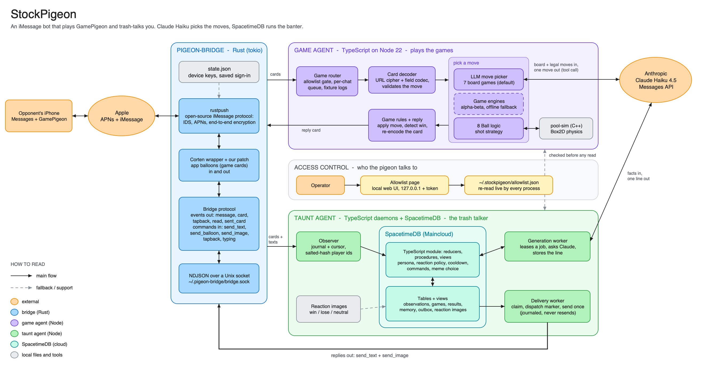

# StockPigeon

An iMessage bot that plays GamePigeon against a real person and talks trash while it does. You text it a game the way you would challenge a friend. It answers with real GamePigeon cards that open in your own GamePigeon app, and it sends its banter as separate texts, sometimes with a meme.



## What it does

- **Plays eight GamePigeon games** over iMessage: 8 Ball, Four in a Row, Gomoku, Reversi, Checkers, Dots & Boxes, Mancala and Filler.
- **Picks moves three ways.** A search engine for the board games, a real pool physics simulation for 8 Ball, and optionally Claude Haiku as a "virtual player" for the board games.
- **Talks.** A separate taunt agent watches every game and texts about leads, fouls, comebacks and results. It answers direct messages, remembers things per player, and takes commands such as `chill` and `roast me harder`.
- **Only talks to people you allow.** An allowlist, editable from a local web page, gates every message before it is read.

## Status

Final as of October 4, 2026. "Played live" means against a real iPhone through a real Apple account.

| Piece | State | Evidence |
|---|---|---|
| iMessage transport (`bridge/`) | Working | Sends and receives texts, GamePigeon cards and images on a real account |
| Four in a Row | Played live | Six games recorded; the engine won the five that finished |
| 8 Ball | Played live | Ten games recorded, with wins on both sides. Physics check: 29 of 30 real strokes reproduced exactly |
| Filler | Played live | Two games, 22 cards exchanged in total; neither was played to the end |
| Mancala | Played live | One full game; the opponent won |
| Gomoku, Reversi, Checkers, Dots & Boxes | Built and tested, not yet played live | Rule tests and bot-versus-bot games through fully encoded cards pass. Formats come from OpenPigeon's source |
| Taunt agent (`taunter/`) | Running live on our staging database | The bridge accepted 13 direct replies, 8 game reactions and 1 reaction image. No send was left uncertain |
| LLM move picker | Built, opt-in | Verified against a mock model across five games. Live games with it were not recorded in the repo's logs |
| Allowlist page | Built | Tested: parsing, live reload, and its access checks |

## How it works

GamePigeon has no game server for turn-based games. Each turn is an iMessage app card whose URL carries the entire game state, lightly scrambled, and the receiving app shows whatever that state says. So the bot never operates GamePigeon. It reads the card's URL as data, picks a move, and sends back a card GamePigeon understands.

Three programs do the work:

1. **pigeon-bridge** (Rust) is our own iMessage client, built on the open-source rustpush library. It signs in like one more Apple device and hands messages to the other two programs as JSON over a local socket.
2. **The game agent** (TypeScript) decodes each card, checks it, picks a move, applies the rules and sends the reply card.
3. **The taunt agent** (TypeScript and SpacetimeDB) only watches. A SpacetimeDB module in the cloud decides when to speak and keeps each player's record and memory; Claude Haiku writes the line; a delivery worker sends it once.

The game agent and the taunt agent never call each other. They share only the bridge, the allowlist and the person on the other end.

### Architecture

Solid arrows are the main flows. Dashed arrows are opt-in or support paths.


Who owns what:

- **Game state** lives in the iMessage card URL. The game agent keeps only in-memory sessions.
- **Conversation, memory, reactions, the outbox and its leases** live in SpacetimeDB, which arbitrates who generates and who sends.
- **The observer's journal and the delivery journal** are local files next to their processes.
- **The allowlist** is one local file shared by every process.

Editable diagrams: [`docs/system-design.excalidraw`](docs/system-design.excalidraw) (the picture above, in depth) and [`docs/stockpigeon-architecture.excalidraw`](docs/stockpigeon-architecture.excalidraw) (a presentation-friendly overview). Open either at [excalidraw.com](https://excalidraw.com) through the menu's Open.

## Games

| Game | Wire name | How the bot plays |
|---|---|---|
| 8 Ball | `pool` | Simulates a few hundred candidate shots on OpenPigeon's C++ Box2D pool engine (`pool-sim`) and sends one that pots |
| Four in a Row | `connect` | Minimax with alpha-beta pruning, or the LLM |
| Gomoku | `renju` | Shared alpha-beta search over the best candidate points, or the LLM |
| Reversi | `reversi` | Shared search, or the LLM. A forced pass is handled inside one card |
| Checkers | `checkers` | Shared search, or the LLM. Mandatory and optional capture modes |
| Dots & Boxes | `dots` | Shared search, or the LLM. All lines of a turn travel in one card |
| Mancala | `mancala` | Shared search, or the LLM. Capture and avalanche modes |
| Filler | `fill` | Shared search, or the LLM. The starting board is rebuilt from the invite's seed |

With `PLAYER=llm`, Claude Haiku picks the move in the seven board games. It is shown the rules, the board as text and the legal moves, and must answer with a tool call naming one of them. The game code still applies the move and decides who won. If the model is slow, unreachable or answers illegally twice, the search engine plays that move, so a game never stalls. 8 Ball always uses the physics engine.

The bot only reports results its own rules code computed, and it does not answer a card it cannot verify.

## Repository layout

```
bridge/            pigeon-bridge: the iMessage transport (Rust)
poolsim/           pool-sim: 8 Ball physics (C++ front end for OpenPigeon's engine)
pigeonai/          the game agent, the LLM move picker and the allowlist page (TypeScript)
taunter/           the taunt agent: observer, workers and the SpacetimeDB module (TypeScript)
reaction_images/   the curated memes, in winning / losing / neutral folders
docs/              diagrams, and build-notes/ with the working documents from the build
```

Each folder has its own README. Third-party code is never committed: `bridge/` and `poolsim/` fetch their upstream sources into a gitignored `.build/` folder at pinned commits.

## Running it

### One-time setup

On macOS 13 or newer with Xcode Command Line Tools, `cargo`, `protoc`, `python3` and Node 22.18 or newer:

```sh
bridge/scripts/setup.sh                   # builds bridge/.build/bin/pigeon-bridge (10 to 15 minutes the first time)
poolsim/scripts/setup.sh                  # builds poolsim/.build/bin/pool-sim (seconds)
bridge/.build/bin/pigeon-bridge login     # Apple ID, password and two-factor code
(cd taunter && npm install)
```

For the taunt agent you also need a SpacetimeDB database and an Anthropic API key. Publish the module, register the images, start any taunt process once to print its worker identity, then authorize that identity:

```sh
cd taunter
spacetime publish <database> --server maincloud --module-path spacetimedb/spacetimedb --no-config --yes
npm run images:sync -- <database>
spacetime call <database> grant_worker <worker identity> --server maincloud
```

### Every session

One terminal window per process, started in this order. `<numbers>` is a comma-separated list such as `+15551234567,+15557654321`; it can be left out for anyone already added on the allowlist page.

```sh
# 1. bridge
bridge/.build/bin/pigeon-bridge run

# 2. game agent (add PLAYER=llm and ANTHROPIC_API_KEY for the LLM move picker)
cd pigeonai && ALLOWED_SENDERS=<numbers> npm run play

# 3. observer
cd taunter && ALLOWED_SENDERS=<numbers> SPACETIME_URI=wss://maincloud.spacetimedb.com SPACETIME_DATABASE=<database> npm run observe

# 4. generator (needs ANTHROPIC_API_KEY in its environment)
cd taunter && SPACETIME_URI=wss://maincloud.spacetimedb.com SPACETIME_DATABASE=<database> npm run generate

# 5. delivery
cd taunter && TAUNTER_SEND_ENABLED=1 TAUNTER_IMAGES_ENABLED=1 ALLOWED_SENDERS=<numbers> SPACETIME_URI=wss://maincloud.spacetimedb.com SPACETIME_DATABASE=<database> npm run deliver

# optional: the allowlist page
cd pigeonai && npm run allowlist
```

Set the API key without putting it in your shell history: run `read -s ANTHROPIC_API_KEY && export ANTHROPIC_API_KEY` on its own line, paste the key, press Enter.

Then an allowed person sends a game to the signed-in account. Windows 1 and 2 alone are enough to play; windows 3 to 5 add the talking.

### Settings

| Variable | Used by | Meaning |
|---|---|---|
| `ALLOWED_SENDERS` | game agent, observer, delivery | Phone numbers or emails the bot may deal with. Combined with the allowlist file |
| `ALLOWLIST_FILE` | same | The file the allowlist page edits (default `~/.stockpigeon/allowlist.json`). `none` turns it off |
| `PLAYER` | game agent | `engine` (default) or `llm` |
| `LLM_MODEL`, `LLM_TIMEOUT_MS` | game agent | Model for the move picker (default `claude-haiku-4-5-20251001`) and the wait per move (default 30000) |
| `MOVE_TIME_MS` | game agent | Search budget per move (default 300) |
| `POOL_MAX_POTS` | game agent | 8 Ball: pots per turn before a deliberate miss (default 3; `0` removes the limit) |
| `DRY_RUN` | game agent | `1` decides and prints but sends nothing |
| `SPACETIME_URI`, `SPACETIME_DATABASE` | taunt agent | Where the SpacetimeDB module runs |
| `ANTHROPIC_API_KEY` | generator, LLM move picker | Read from the environment only; never stored |
| `TAUNTER_SEND_ENABLED` | delivery | Must be `1` or the delivery worker refuses to start |
| `TAUNTER_IMAGES_ENABLED` | delivery | `1` also sends reaction images |

The rest are listed in each folder's README.

## Talking to it

The taunt agent reacts on its own to fouls, lead changes, comebacks and final results, with plain banter in quiet stretches. Unprompted texts are at least a minute apart, except that a final result is always answered. It also replies to ordinary texts, and understands these whole-message commands:

| Text | Effect |
|---|---|
| `chill` / `roast me harder` | Gentler or harsher tone |
| `just play` | No unprompted remarks; questions and commands still get answers |
| `no memes` | No reaction images |
| `record` / `status` | Verified results so far; the latest game it saw |
| `remember <fact>` / `memory` / `clear memory` | Save, list or erase what it knows about you |
| `help` | The list |

## Safety and privacy

- **The Apple account.** The bridge is signed into a personal Apple ID and therefore receives every iMessage sent to that person. Nothing is decoded, logged or answered unless the sender is on the allowlist, and group chats are ignored.
- **The allowlist** lives outside the repository (`~/.stockpigeon/allowlist.json`, owner-only). The page that edits it listens on this machine only and requires a one-time token.
- **Player identities.** The taunt agent stores a salted hash of each handle, never the phone number. Recipients are resolved locally at send time.
- **What reaches Anthropic.** For banter: a few game facts and the player's own recent messages. For the LLM move picker: the board, the rules and the legal moves. Never phone numbers or player IDs.
- **Sending.** The taunt agent can send only plain texts and approved images, never game cards. If it is unsure whether a message went out, it does not send it again.

## Testing

```sh
cd pigeonai && npm test     # 31 tests: every game's rules, the search, card building, the LLM picker, the allowlist
cd taunter && npm test      # 44 tests: observation, game reading, personality, commands, delivery, images
```

`taunter/` also has end-to-end suites that run the real processes against a local SpacetimeDB server, a stand-in bridge and a mock model (`npm run spike:conversation`, `spike:reactions`, `spike:images`). `pigeonai/spike/pool-fidelity.ts` replays captured 8 Ball turns through the physics engine.

## Known limitations

- **Four board games are unproven on real phones.** Gomoku, Reversi, Checkers and Dots & Boxes were built from OpenPigeon's source and have not been played live. A card the agent cannot read is logged and not answered.
- **The LLM player is opt-in** (`PLAYER=llm`) and its strength is untested; Claude Haiku is a weaker player than the search engine.
- **Games are forgotten on restart.** Sessions live in memory; the card itself still carries the game.
- **8 Ball.** Ball in hand is unused (the bot shoots from the center spot), a ball rattling in a pocket can differ from the phone, and ball textures may face the wrong way.
- **Checkers has no draw rule** in the app, so evenly matched kings can shuffle indefinitely.
- **Card wording.** Four in a Row cards say "Pigeon played column N" where a real card says "Your move.".
- **Chess, Sea Battle, Crazy 8, 20 Questions, word games and the other physics games** are not supported; their invites are recorded and ignored.
- **Old names.** The staging database is still called `photonpigeon-conversation-staging`, from the project's first name.
- **Leftovers.** `pigeonai/src/index.ts`, `pigeonai/spike/probe.ts`, `pigeonai/.agents/`, `.env.example` and the `spectrum-ts` dependency belong to an abandoned first plan and are unused.

## Credits, licences and risk

- This uses Apple's private iMessage protocol through an unofficial client. Apple can restrict it or flag the account at any time, and here that account is a personal one.
- [OpenBubbles/rustpush](https://github.com/OpenBubbles/rustpush) is SSPL-1.0 and Corten ([lrhodin/imessage](https://github.com/lrhodin/imessage)) is MPL-2.0. [OpenBubbles/OpenPigeon](https://github.com/OpenBubbles/OpenPigeon), whose pool engine we run and whose source taught us the board-game formats, is source-available under PolyForm Shield 1.0.0. All are fine for a personal project and need review before distributing anything.
- The card URL codec is vendored from time-attack/OpenPigeon under MIT, with its licence file kept.
- Not affiliated with GamePigeon, Apple, OpenBubbles, SpacetimeDB or Anthropic.

## More

- [`bridge/README.md`](bridge/README.md): building, signing in, the socket protocol
- [`pigeonai/README.md`](pigeonai/README.md): the game agent, the LLM move picker, the allowlist page
- [`taunter/README.md`](taunter/README.md): the taunt agent and its SpacetimeDB module
- [`poolsim/README.md`](poolsim/README.md): the pool simulator
- [`docs/build-notes/`](docs/build-notes/README.md): the working documents from the build, kept for history
