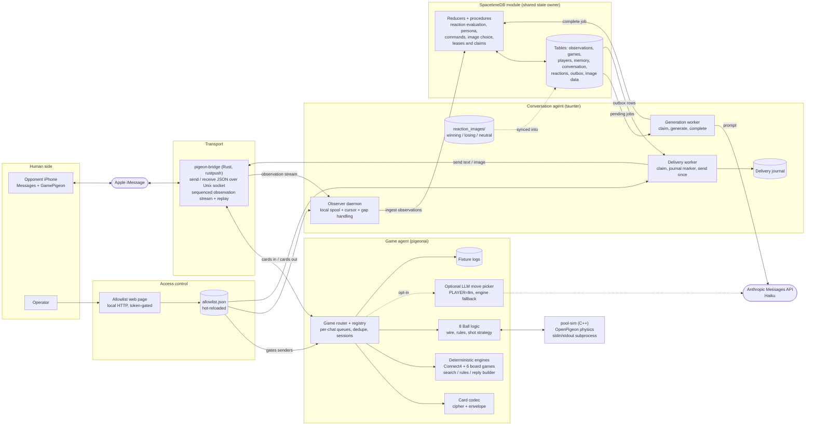

# StockPigeon

An iMessage bot that plays GamePigeon games against a real person. You send it a game the way you would challenge a friend, and it plays back with real GamePigeon cards that open in your own GamePigeon app.

This file is the single write-up of the project as of **2026-10-03**. It replaces the original design, system, requirements, and Phase 0 documents, which described a Photon-based plan that was abandoned (see [How we got here](#how-we-got-here)). Those files are in git history before this change if they are ever needed.

## Status

| Piece | State | Evidence |
|---|---|---|
| iMessage transport (`bridge/`) | Working | Sends and receives texts and GamePigeon cards on a real account |
| Four in a Row | Working, played live | Five full games against a real iPhone; the bot won all five |
| 8 Ball | Working, played live once | One full game against a real iPhone; the opponent won |
| 8 Ball physics (`poolsim/`) | Matches real phones closely | 29 of 30 real strokes reproduced exactly (details below) |
| Chat, banter, persona (`taunter/`) | Built and verified against mocks; live run started October 4, validation checklist not completed | Game reactions, text conversation with per-player memory and commands, and a send-only delivery worker pass a full mocked suite. On October 4 the daemons ran against the staging database and the bridge accepted nine conversation texts; arrival on the phones has not been recorded. [plan](SPACETIME_PERSONALITY_PLAN.md), [status](taunter/README.md) |
| Reaction images (`reaction_images/`, `taunter/`) | Stored and chosen in the database; sending is mock-verified, not live | 25 curated images in `winning`, `losing` and `neutral` buckets are stored in the staging database. About one reaction in three gets one, sent after its text. The bridge's `send_image` command is written but needs a rebuild and has never run; [details](taunter/README.md#reaction-images) |
| Gomoku, Reversi, Checkers, Dots & Boxes, Mancala, Filler | Built and tested against each other; never played on a real phone | Formats come from OpenPigeon's source, not from captures. Each game passes its own rule tests and a bot-versus-bot game through fully encoded cards. The first real game of each is the real test; details below |
| Other games | Not built | Invites are recorded and ignored |

The conversation agent's status, commands, delivery rules and test commands are in [taunter/README.md](taunter/README.md). Its one remaining step is controlled live validation, which needs the rebuilt bridge restarted, a runtime Anthropic key and the authorized tester.

## How it works

GamePigeon has no game server for turn-based games. Each turn is an iMessage app card whose URL carries the entire game state, and the receiving app shows whatever that state says. So the bot never operates GamePigeon. It reads the card's URL as data, computes a move, and sends back a card GamePigeon understands.

```
Opponent's iPhone (Messages + GamePigeon)
        │  iMessage app cards; the card URL holds the game state
        ▼
Apple iMessage
        │
        ▼
bridge/   pigeon-bridge (Rust)
          signs an Apple ID into iMessage through rustpush and
          exposes send/receive as JSON lines on a local Unix socket
        │
        ▼
pigeonai/ the agent (TypeScript)
          transport/bridge.ts        client for the socket
          gamepigeon/vendor/         URL codec (cipher + envelope)
          games/connect4/            Four in a Row: rules, search, reply builder
          games/pool/                8 Ball: rules, shot selection, turn builder
          agent.ts                   the loop: decode → decide → send
        │  (8 Ball only)
        ▼
poolsim/  pool-sim (C++)
          OpenPigeon's pool physics as a command-line tool
```

By default no LLM is involved in gameplay: every move comes from a deterministic engine. The `llm-player` branch adds an opt-in experiment in which a model picks the moves in the board games (see [LLM player](#llm-player-experiment)). The separate conversation agent uses Anthropic Haiku for text generation; one real API request is verified, and text delivery is verified against a fake bridge only. Conversational replies are separate text messages, never part of a game move.

## System architecture

Conceptual components and runtime flows, as implemented at commit `65292be`. Solid arrows are implemented and exercised. Dashed arrows are opt-in or unverified (the LLM move picker, and reaction-image sync and sending, which are mock-verified only).



A presentation-friendly version of the same architecture is in [`stockpigeon-architecture.excalidraw`](stockpigeon-architecture.excalidraw). Open it at [excalidraw.com](https://excalidraw.com) (File → Open) or in the VS Code Excalidraw extension.

State ownership:

- **Game state** lives in the iMessage card URL. The game agent keeps only in-memory sessions.
- **Conversation, memory, reactions, outbox and leases** are owned by SpacetimeDB, which arbitrates generation and send claims.
- **The observer spool and delivery journal** are local to their processes.
- **The allowlist** is a single local file shared by every process.

The game agent and the conversation agent do not call each other. They share only the bridge, the allowlist and the human on the other end.

## Repository layout

```
bridge/            iMessage transport
  src/pigeon-bridge.rs   the bridge binary: `login` and `run`
  patches/apply.py       adds app-card support to the upstream wrapper
  scripts/setup.sh       fetches upstream at pinned commits and builds
  README.md              build, sign-in, and the socket protocol
poolsim/           8 Ball physics
  src/main.cpp           command-line front end for the upstream engine
  scripts/setup.sh       fetches upstream at pinned commits and builds
  README.md              the line protocol
pigeonai/          the agent
  src/agent.ts           entry point (`npm run play`)
  src/transport/         bridge client
  src/gamepigeon/vendor/ URL codec, vendored from time-attack/OpenPigeon (MIT)
  src/games/connect4/    rules.ts, strategy.ts, turn.ts
  src/games/pool/        wire.ts, sim.ts, rules.ts, strategy.ts, turn.ts
  spike/                 bridge-probe.ts (transport test), pool-fidelity.ts (physics check)
  test/                  unit tests (`npm test`)
  logs/fixtures/         every card seen or sent, decoded (gitignored)
```

Third-party code is never committed. Both `bridge/` and `poolsim/` fetch their upstream sources into a gitignored `.build/` directory at commits pinned in `pins.env`.

## Running it

One-time setup, on macOS 13 or newer with Xcode Command Line Tools, `cargo`, `protoc`, and `python3`:

```sh
bridge/scripts/setup.sh              # builds bridge/.build/bin/pigeon-bridge (10-15 minutes the first time)
poolsim/scripts/setup.sh             # builds poolsim/.build/bin/pool-sim (seconds)
bridge/.build/bin/pigeon-bridge login   # asks for the Apple ID, password, and two-factor code
```

Every session, in two terminal windows:

```sh
bridge/.build/bin/pigeon-bridge run

cd pigeonai
ALLOWED_SENDERS=+15551234567 npm run play
```

Then the allowed person sends a Four in a Row or 8 Ball game to the signed-in account.

Agent settings (environment variables):

| Variable | Default | Meaning |
|---|---|---|
| `ALLOWED_SENDERS` | none | Phone numbers or emails the bot may play against, comma-separated. People added on the allowlist page are allowed as well |
| `ALLOWLIST_FILE` | `~/.stockpigeon/allowlist.json` | The file the allowlist page edits. `none` turns it off, so only `ALLOWED_SENDERS` counts |
| `DRY_RUN` | off | `1` decides and prints but sends nothing |
| `MOVE_TIME_MS` | 300 | Four in a Row search budget |
| `POOL_MAX_POTS` | 3 | 8 Ball: potting strokes per turn before the bot plays a deliberate miss. `0` removes the limit |
| `REPLY_STYLE` | `plain` | `session` sends follow-up moves attached to the opponent's card, as real phones do |
| `DATA_DIR` / `LOG_DIR` | `./data` / `./logs` | Bot identity; per-card fixtures |
| `BRIDGE_SOCKET` | `~/.pigeon-bridge/bridge.sock` | Where the bridge listens |

Rebuild the bridge only after changing something under `bridge/`. The agent is TypeScript run directly by Node (`--experimental-strip-types`), so it needs only a restart.

## The transport

`pigeon-bridge` is our own iMessage layer. It is built on [OpenBubbles/rustpush](https://github.com/OpenBubbles/rustpush), an open implementation of Apple's iMessage protocol, through the wrapper in [lrhodin/imessage](https://github.com/lrhodin/imessage) ("Corten"), which registers a Mac natively without disabling SIP.

Upstream drops app cards in both directions, so `patches/apply.py` adds three things: card fields on received messages, card fields on received session replies, and a `send_balloon` call. `bridge/README.md` documents the socket protocol.

Things worth knowing:

- **Account.** The bridge is signed into a teammate's personal Apple ID. It becomes another device on that account, so it receives every iMessage sent to that person. The agent only decodes, logs, or answers senders in `ALLOWED_SENDERS`. Contact Key Verification must be off on the account.
- **The owner cannot be the opponent.** The bot is the account owner as far as iMessage is concerned. Cards the owner sends from their own phone do reach the bridge, which is how real games are captured.
- **State.** Sign-in tokens are stored in plain text in `~/.pigeon-bridge/state.json`, readable only by the owner.
- **Events are not replayed.** A card that arrives while no agent is connected is lost to the agent.

## What we learned about GamePigeon's messages

These were confirmed against real cards from GamePigeon on iOS 26.

**The card.** An iMessage app card addressed to GamePigeon's extension: bundle ID `com.apple.messages.MSMessageExtensionBalloonPlugin:EWFNLB79LQ:com.gamerdelights.gamepigeon.ext`, app name `GamePigeon`, App Store ID `1124197642`. Real cards are marked "live" and all cards in one game share a session ID. The bot copies the identity, session, icon, and live flag from the opponent's card.

**Follow-up moves arrive as replies.** The first card in a game is an ordinary message. Every later card is sent as a reply attached to the previous card (an "extension reaction" in the protocol), which unpatched clients report as a tapback with no content. The bot may send its own moves either way; plain messages work.

**The URL.** `data:?ver=52&data=<text>`. The text is a `key=value&…` list scrambled with a keyless shuffle (seeded from its length) and percent-encoded. `src/gamepigeon/vendor/` implements it.

**Fields common to all games.**

| Field | Meaning |
|---|---|
| `game` | `connect`, `pool`, `pool2` (9 Ball), `pool3` (8 Ball+), `beer` (Cup Pong), `golf`, `anagrams`, … |
| `id` | Game ID |
| `num` | Message counter, starting at 1 for the invite, +1 per card |
| `sender`, `player1`, `player2` | Player IDs: an uppercase UUID plus six base62 characters |
| `player` | The slot (1 or 2) of whoever sent this card |
| `replay` | The game-specific state |
| `winner` | Present on the final card |
| `build` | A different random token on every card; we copy the opponent's |

The person who sends the invite is player 2. The recipient moves first as player 1, and its first card drops the invite-only fields (`start`, `caption`, `game_name`, `seed`).

Real cards are captioned "Your move." and, on a winning card, "I won!".

**Four in a Row.** `replay` is `board:<42 cells>|move:<col>,<row>,<player>`. Cells run bottom row first; 0 is empty, 1 and 2 are the players. The board is the position before the move, and the receiver animates the move onto it. A winning card adds `winner=<id>|<slot>`.

**8 Ball.** `replay` carries the stroke inputs and the table before and after, not the motion:

```
&d:<direction>&x:<spinX>&y:<spinY>&p:<power>&s:<n>&balls:<table before>     first stroke
&d:…&x:…&y:…&p:…&s:<n>                                                      more strokes, if any
&o:<pocket>&d:…                                                             a shot at the 8 names its pocket
balls:<table after>&stripes:<n>[&move:1][&win:1|-1]                          always last
```

A turn has one segment per stroke, because pocketing your own ball lets you shoot again. A table is a list of `x,y,rotation,density,number,…` entries on a 784 x 440 table with balls 20 wide; ball 0 is the cue ball and pocketed balls are absent. `stripes` and `s` name the player slot holding stripes (0 while undecided). `move:1` means the sender fouled and the receiver has the cue ball in hand. The receiving phone re-runs the physics from the stroke inputs, so the sender's physics has to agree with it. The winning card sets `winner=<id>|1`.

## Game engines

### Four in a Row (`src/games/connect4/`)

- `rules.ts`: the board, legal moves, win detection, and validation of an opponent's position.
- `strategy.ts`: negamax search with alpha-beta pruning and iterative deepening under a time budget. It always takes a win in one and blocks a loss in one. It is deterministic.
- `turn.ts`: reads the opponent's move and builds the reply, carrying forward any field it does not understand.

The agent refuses to move if the opponent's card does not validate.

### 8 Ball (`src/games/pool/` and `poolsim/`)

The physics is not ours. `poolsim/` builds the pool engine from [OpenBubbles/OpenPigeon](https://github.com/OpenBubbles/OpenPigeon), an Android GamePigeon-compatible client, unmodified. That engine is C++ on a Box2D fork tuned to behave like GamePigeon. Our only native code is a small `main.cpp` that drives it over a pipe.

- `wire.ts`: reads the 8 Ball message format.
- `sim.ts`: client for `pool-sim`.
- `rules.ts`: fouls (cue ball pocketed, no contact, wrong group first), shooting again after a pot, group assignment, and the called pocket for the 8. Taken from OpenPigeon's code.
- `strategy.ts`: aims at each legal ball for each pocket, simulates a few hundred candidate strokes, and scores them by the rules. Among strokes that pot, it prefers ones that still pot when the aim is nudged slightly.
- `turn.ts`: plays a whole turn and builds the message. Strokes are rounded to the message's six decimals before they are simulated, so what is tested is what is sent.

**How faithful the physics is.** Real turns were replayed through the engine from their stroke inputs and compared with the table the phone sent:

- Capture game (two phones playing each other): 20 of 21 strokes exact. The one miss was a ball beside a corner pocket that the phone dropped and the engine rattled out.
- Live game against the bot: all 9 of the opponent's strokes exact, and every one of the opponent's turns started from exactly the table the bot had reported.

**Honesty.** The message format lets a sender claim any result. The bot only reports what the engine computed for the strokes it sends, misses and fouls included.

### Board games (`src/games/common/` and one folder each)

Added October 4: Gomoku, Reversi, Checkers, Dots & Boxes, Mancala and Filler. None needs physics. They share two pieces:

- `common/search.ts`: one move chooser for all of them (minimax with alpha-beta pruning, deepened until the time budget runs out). It asks the game whose move it is, so games where a side moves several times in a row work.
- `common/card.ts`: the envelope around a move. A reply starts from the opponent's fields, claims our slot, bumps `num`, and adds the game's own fields.

Each game folder has one `game.ts`: how to read a card, the rules, how positions are scored, and the fields to send back.

| Game | Wire name | State travels in | Notes |
|---|---|---|---|
| Gomoku | `renju` | `map` (the board before the move) and `move` (`row,col,stone`) | 13 x 13. Five or more wins. Stone 2 is player 1 |
| Reversi | `reversi` | `replay`: board before, moves, board after | When the opponent must pass, the same player's moves share one card |
| Checkers | `checkers` | `replay`: board before, each hop, board after | `mode` n makes captures mandatory. Kings move one step. No draw rule exists in the app |
| Dots & Boxes | `dots` | `replay`: board before, lines and boxes of the turn, board after | `size` is dots per side. All lines of a turn share one card |
| Mancala | `mancala` | `replay`: board before, pit choices, board after | Capture and avalanche modes. Stones carry colour labels |
| Filler | `fill` | `replay`: board before, colour, board after | The invite carries only `seed`; the starting board is generated from it |

**Where the formats come from.** Not from captures. They were read out of OpenPigeon's game scripts, whose Four in a Row format matches our real captures exactly. Where OpenPigeon embeds sample messages or the rules could be worked by hand (a crowned Checkers piece that keeps jumping, a three-box Dots turn, four Mancala turns, the Filler board for seed 0), the modules reproduce them exactly.

**What is not known until a real game is played:**

- Whether the real app's cards carry the same fields as OpenPigeon's. A card the agent cannot read is logged and not answered.
- Filler's starting board must match the phone's exactly, because the invite carries only a seed. It matches an independent port of OpenPigeon's generator; it has not been compared with a phone.
- Whether a real Mancala invite carries its starting board. If it does not, the agent assumes four stones per pit.
- How the real app delivers the last card of a Dots & Boxes game; OpenPigeon's normal path never sends it.

**The chat agent follows these games too** (added October 4). It reads each card with the same board readers, reports a result only when the board itself is finished, and reports a lead only past a clear margin (discs, pieces, boxes, stones, area; for Gomoku, an unanswered five-in-a-row threat). Cards from games it does not follow, such as Cup Pong, are skipped.

### The allowlist page

```sh
cd pigeonai && npm run allowlist      # prints a link; open it in a browser
```

A local page for adding and removing the people the bot may play and talk with, so nobody has to edit `ALLOWED_SENDERS` and restart four windows. It writes `~/.stockpigeon/allowlist.json` (outside the repository, readable by its owner only). The game agent, the chat observer and the delivery worker each re-read that file when it changes, within about a second, so a new person can play straight away and a removed person is ignored from the next message on.

- The allowlist is `ALLOWED_SENDERS` plus the file. People named in `ALLOWED_SENDERS` are not shown on the page and can only be removed by restarting without them.
- The page listens on this machine only, and every request needs the one-time token in the printed link, so another program or a web page cannot change the list. It never reads messages and never talks to the bridge.
- A missing or damaged file allows nobody extra.
- All processes share the one file. To give a process a narrower list (the delivery worker during a live test, say), start it with `ALLOWLIST_FILE=none` and its own `ALLOWED_SENDERS`.
- Ten-digit numbers are taken to be US numbers; anything else needs its country code.

Code: `pigeonai/src/allowlist.ts` (the list) and `pigeonai/src/allowlist-ui.ts` (the page).

### LLM player (experiment)

Branch `llm-player`, off by default. Started with `PLAYER=llm`, the agent asks a language model for each move in the turn-based games: Four in a Row, Gomoku, Reversi, Checkers, Dots & Boxes, Mancala and Filler. The point is an opponent that plays like a person rather than a search engine. 8 Ball is physics and always uses the engine.

- **What the model does.** It is shown the rules in a few sentences, the board as text from its own side, and how to write a move. It answers through a forced tool call with a short line of reasoning and one move. When there are 64 legal moves or fewer they are listed and are the only answers the tool accepts.
- **What the model cannot do.** It does not apply the move, build the card or decide the result; the game module does all of that, exactly as for the engine. An answer that is not a legal move gets one correction, then the engine plays that move. A slow or failing API also hands the move to the engine, so a game never stalls. A forced move costs no model call.
- **What is sent.** The board, the rules summary and the legal moves. No phone numbers, player ids or message text.
- **Code.** `src/llm/player.ts` (the player and the API call), `src/llm/connect4.ts` (Four in a Row in words), and a `brief` function in each board game. Every game takes a `pick` function; `enginePicker` and `modelPicker` are the two implementations.

```sh
read -s ANTHROPIC_API_KEY && export ANTHROPIC_API_KEY     # on its own line, then paste the key
PLAYER=llm ALLOWED_SENDERS=+15551234567 npm run play
```

`LLM_MODEL` chooses the model. The default is `claude-haiku-4-5-20251001`, the same model the chat agent uses, chosen to keep each move fast and cheap. `claude-sonnet-4-6` is the next step up. `LLM_TIMEOUT_MS` is the wait per move (default 30000).

**Status.** Verified with a mock model only: the real agent process played five games against a stand-in bridge, with the mock choosing legal moves or nonsense. No real model has picked a move yet, so how well one actually plays, and how long it takes, is unknown.

## Testing

- `npm test` in `pigeonai/`: 28 tests. 16 cover Four in a Row and 8 Ball (rules, search, message builders). 3 cover the LLM player (legal answers, corrections, engine fallback, the API request). 9 cover the board games: the shared search and envelope, each game's rules against worked examples, and two bots playing every game to the end through encoded cards.
- Simulated opponents: the agent has been run end to end against stand-in bridges that play Four in a Row and 8 Ball and check every card it sends. On October 4 the same was done for the six board games: the real agent process was invited to each and played all six to the end. These scripts were throwaway and are not in the repo.
- `spike/pool-fidelity.ts`: replays every captured 8 Ball turn through the engine and reports how far each ball lands from where the phone put it.
- `logs/fixtures/`: every GamePigeon card from an allowed sender, and every card the bot sends, is saved decoded. Cards the account owner sends from their own phone are saved as `own`. These contain player IDs, so the directory is gitignored.

## How we got here

The project was called PhotonPigeon until October 4, 2026, after the Photon plan it started from. It is now StockPigeon, the name the bot uses for itself. The old name survives in a few places that cannot simply be edited: the staging database (`photonpigeon-conversation-staging`) and, until its owner renames it, the GitHub repository.

1. **Original plan: Photon.** The project was designed around Photon Spectrum Cloud carrying GamePigeon cards. On 2026-10-03 the Phase 0 test showed Photon's Pro plan blocks both directions: sending under GamePigeon's identity is rejected (`PERMISSION_DENIED`), and received third-party cards arrive with no URL.
2. **Own transport.** Rather than switch providers, we built `bridge/` on rustpush. The same Phase 0 test passed on it the same day.
3. **Personal account.** A dedicated bot Apple ID was the first choice; we used a teammate's personal account to move faster.
4. **Four in a Row.** Built and played live the same evening.
5. **8 Ball.** The original design ruled out physics games because a bot could not produce a credible shot. Finding OpenPigeon's engine changed that: a faithful simulator produces computed outcomes, not invented ones.

## Known gaps

- **Live chat is not validated.** The conversation agent in `taunter/` passes its mocked end-to-end suite and has been run against the real bridge (nine texts accepted on October 4), but the live validation checklist has not been worked through.
- **Reaction images have never reached a phone.** Sending passes against a fake bridge; the real bridge's `send_image` command has not been compiled or run. Gameplay remains deterministic.
- **Games are forgotten on restart.** Sessions live in memory.
- **8 Ball: ball in hand is unused.** After an opponent's foul the bot shoots from the center spot.
- **8 Ball: ball textures.** Moved balls keep their old rotation values, so the numbers may face the wrong way. Cosmetic.
- **8 Ball: pocket edges.** A ball rattling in a pocket is where the engine and the phone can disagree. The shot selection avoids such shots but cannot rule them out.
- **8 Ball: paths not exercised live.** The bot winning, the bot fouling, and the opponent fouling.
- **Four in a Row: opponent wins and draws** have not happened live.
- **Card wording.** Four in a Row cards say "Pigeon played column N — your move" where a real card says "Your move.".
- **Leftover Photon scaffold.** `pigeonai/src/index.ts`, `pigeonai/spike/probe.ts`, the `spectrum-ts` dependency, `pigeonai/.agents/`, and `.env.example` belong to the abandoned plan and are unused.

## Where it could go next

- **9 Ball and 8 Ball+** use the same pool engine; they need rules and racks.
- **Mini Golf, Shuffleboard, Knockout** have their own C++ engines in OpenPigeon that could be wrapped the same way.
- **Chess, Sea Battle, Crazy 8 and 20 Questions** are the turn-based games still missing. Chess needs a full rules engine; Sea Battle and Crazy 8 have hidden information.
- **Trash talk for further games** follows automatically once the chat agent can read their boards (`taunter/src/assessment.ts`).
- **Word Hunt and Anagrams** have a different shape: the invite fixes the letters, each player sends one round, and a final card carries both scores. A bot round should be capped at what a person could plausibly find.
- **Cup Pong, Darts, Archery, Basketball, Tanks** are Godot scenes in OpenPigeon, not standalone engines. Running them would be a separate project.

For any new game, capture a real one first: have the opponent play the account owner's own phone with the agent running, and both sides land in `logs/fixtures/`.

## Risks and licences

- This uses Apple's private iMessage protocol through an unofficial client. Apple can restrict it or flag the account at any time, and here that account is a personal one.
- rustpush is SSPL-1.0 and Corten is MPL-2.0. OpenPigeon (OpenBubbles) is source-available under PolyForm Shield 1.0.0, which permits any use except a product that competes with it. All three are fine for a personal project and need review before distributing anything.
- The URL codec is vendored from time-attack/OpenPigeon under MIT, with its licence file kept.
- This is not affiliated with GamePigeon, Apple, or OpenBubbles.
